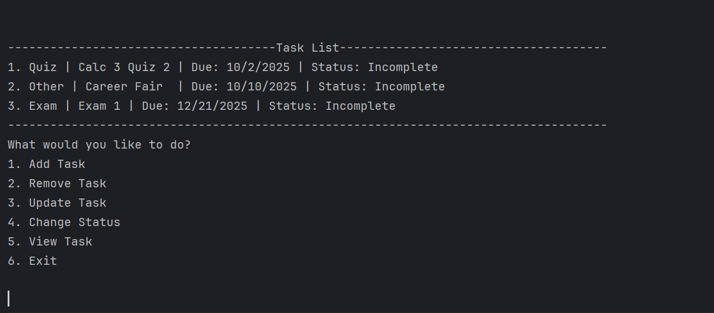

# School Management System

A simple **C++ & SQLite3-based task manager** that lets you keep track of assignments, quizzes, and events.  
This project demonstrates database integration with `sqlite3` for persistence, along with a command-line interface for task management.

---

## Features

- 📌 **Add Task** – Save tasks with type, title, and due date  
- ❌ **Remove Task** – Delete tasks by selecting from the list  
- ✏️ **Update Task** – Edit task details (type, title, due date)  
- ✅ **Change Status** – Mark tasks as complete or incomplete  
- 📋 **View Tasks** – Display all tasks in a neat list  
- 💾 **Persistent Storage** – Tasks are stored in an SQLite database, so they remain after restarting the program  

---

## Example

When you run the program, you can interact with the menu like this:



---

## Database Schema

The program creates a table called `tasks` if it does not already exist:

```sql
CREATE TABLE IF NOT EXISTS tasks (
    id INTEGER PRIMARY KEY AUTOINCREMENT,
    type TEXT NOT NULL,
    title TEXT NOT NULL,
    dueDate TEXT,
    status INTEGER NOT NULL
);
